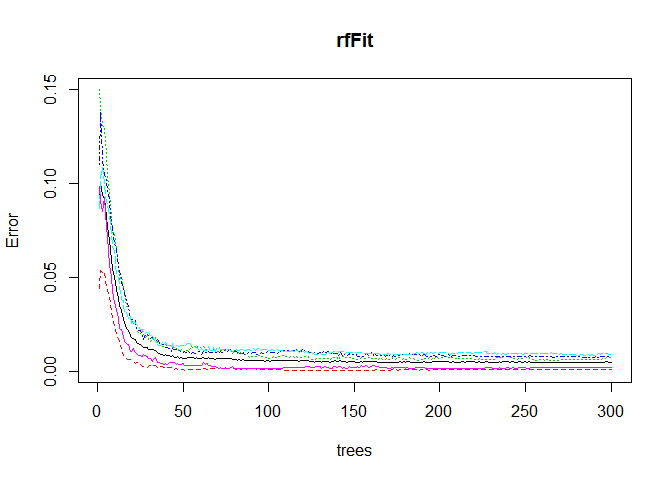
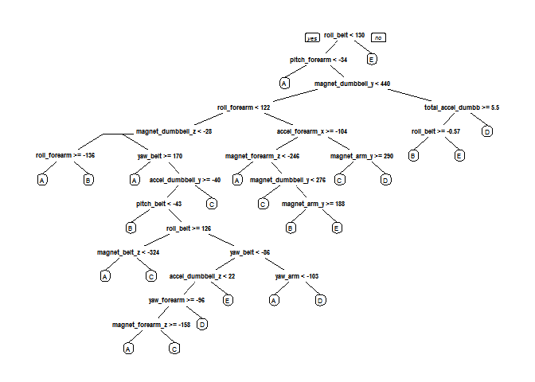

# Practical Machine Learning Course Project


### Background

Using devices such as Jawbone Up, Nike FuelBand, and Fitbit it is now possible to collect a large amount of data about personal activity relatively inexpensively. These type of devices are part of the quantified self movement - a group of enthusiasts who take measurements about themselves regularly to improve their health, to find patterns in their behavior, or because they are tech geeks. One thing that people regularly do is quantify how much of a particular activity they do, but they rarely quantify how well they do it. 

In this project, your goal will be to use data from accelerometers on the belt, forearm, arm, and dumbell of 6 participants. They were asked to perform barbell lifts correctly and incorrectly in 5 different ways. More information is available from the website here: http://groupware.les.inf.puc-rio.br/har (see the section on the Weight Lifting Exercise Dataset). 


```r
options( warn = -1 )
library(caret)
```

```
## Loading required package: lattice
## Loading required package: ggplot2
```

```r
library(kernlab)
library(rpart)
library(rpart.plot)
library(randomForest)
```

```
## randomForest 4.6-10
## Type rfNews() to see new features/changes/bug fixes.
```


```r
# Download the training and test data and save them in the data folder.

#if(!file.exists("data")){dir.create("data")}
#trainingDataURL <- "https://d396qusza40orc.cloudfront.net/predmachlearn/pml-training.csv"
#testingDataURL <- "https://d396qusza40orc.cloudfront.net/predmachlearn/pml-testing.csv"

#if (!file.exists("pml-training.csv")) {
    #download.file(trainingDataURL, destfile="./data/pml-training.csv")
#}

#if (!file.exists("pml-testing.csv")) {
    #download.file(testingDataURL, destfile="./data/pml-testing.csv")
#}
```


```r
# load the data as dataframe.
trainingData <- read.csv("./data/pml-training.csv") 
testingData <- read.csv("./data/pml-testing.csv") 


# check the structure of the dataframe
#str(trainingData)
#str(testingData)
```


```r
dim(trainingData)
```

```
## [1] 19622   160
```

```r
dim(testingData)
```

```
## [1]  20 160
```

The training data has 19622 observations with 160 categories/variables and the testing data has 20 observations with 160 variables. The "classe" category is the prediction variable. 


###Data Cleaning

The data has missing values (NA) and some variables that have no use for prediction. using the following R script, first we remove the missing valuses, then remove the categories with timestamp and window columns from the training and testing data.


```r
sum(complete.cases(trainingData))
```

```
## [1] 406
```

```r
sum(complete.cases(testingData))
```

```
## [1] 0
```

```r
# Remove missing values, NA
trainingData <- trainingData[, colSums(is.na(trainingData)) == 0]
testingData <- testingData[, colSums(is.na(testingData)) == 0]

classe <- trainingData$classe
remove_from_training <- grepl("^X|timestamp|window", names(trainingData))
trainingData<- trainingData[, !remove_from_training]
trainTidy <- trainingData[, sapply(trainingData, is.numeric)]
trainTidy$classe <- classe

remove_from_testing <- grepl("^X|timestamp|window", names(testingData ))
testingData <- testingData[, !remove_from_testing]
testTidy <- testingData[, sapply(testingData, is.numeric)]

#str(trainTidy)
#str(testTidy )
```


```r
dim(trainTidy)
```

```
## [1] 19622    53
```

```r
dim(testTidy )
```

```
## [1] 20 53
```

Now, the tidy training data has 19622 observations with 53 variables and the tidy testing data has 20 observations and 53 variables.

###Data Slicing

In this step we use data slicing to later perform cross-validation within the training set inorder to evaluate the models. Therefore, we split the data based on the classe variable to allocate 70% of tidy training data for training set and the other 30% for testing set. 


```r
set.seed(376259) # for reproducibility
inTrain <- createDataPartition(trainTidy$classe, p=0.70, list=F)
trainData <- trainTidy[inTrain, ]
testData <- trainTidy[-inTrain, ]
```

###Model comparison

Now we can compare three models: kernlab, rpart and random forests by estimating their performances on the validation data set and estimate their prediction errors with cross-validation.

#### First Model : Using kernlab to fit a support vector machine with a laplacian kernel and predict for testing set


```r
svmFit <- ksvm(classe ~ ., data = trainData, kernel = "laplacedot", C = 50)
```

```
## Using automatic sigma estimation (sigest) for RBF or laplace kernel
```

```r
svmPredict <- predict(svmFit, testData, type = "response")
confusionMatrix(testData$classe, svmPredict)
```

```
## Confusion Matrix and Statistics
## 
##           Reference
## Prediction    A    B    C    D    E
##          A 1674    0    0    0    0
##          B    6 1130    2    0    1
##          C    0    2 1021    3    0
##          D    0    0   16  946    2
##          E    0    0    0    0 1082
## 
## Overall Statistics
##                                           
##                Accuracy : 0.9946          
##                  95% CI : (0.9923, 0.9963)
##     No Information Rate : 0.2855          
##     P-Value [Acc > NIR] : < 2.2e-16       
##                                           
##                   Kappa : 0.9931          
##  Mcnemar's Test P-Value : NA              
## 
## Statistics by Class:
## 
##                      Class: A Class: B Class: C Class: D Class: E
## Sensitivity            0.9964   0.9982   0.9827   0.9968   0.9972
## Specificity            1.0000   0.9981   0.9990   0.9964   1.0000
## Pos Pred Value         1.0000   0.9921   0.9951   0.9813   1.0000
## Neg Pred Value         0.9986   0.9996   0.9963   0.9994   0.9994
## Prevalence             0.2855   0.1924   0.1766   0.1613   0.1844
## Detection Rate         0.2845   0.1920   0.1735   0.1607   0.1839
## Detection Prevalence   0.2845   0.1935   0.1743   0.1638   0.1839
## Balanced Accuracy      0.9982   0.9982   0.9908   0.9966   0.9986
```

```r
svm_Accuracy <- postResample(svmPredict, testData$classe)
svm_Accuracy
```

```
##  Accuracy     Kappa 
## 0.9945624 0.9931212
```


#### Second Model : Using rpart to build a decision tree and predict for testing set


```r
rpartFit <- train(classe ~ ., data = trainData, method = "rpart")
rpartPredict <- predict(rpartFit, testData, type = "raw")
confusionMatrix(testData$classe, rpartPredict)
```

```
## Confusion Matrix and Statistics
## 
##           Reference
## Prediction    A    B    C    D    E
##          A 1537   18  115    0    4
##          B  485  363  291    0    0
##          C  467   30  529    0    0
##          D  438  166  360    0    0
##          E  160  132  283    0  507
## 
## Overall Statistics
##                                          
##                Accuracy : 0.4989         
##                  95% CI : (0.486, 0.5118)
##     No Information Rate : 0.5246         
##     P-Value [Acc > NIR] : 1              
##                                          
##                   Kappa : 0.3448         
##  Mcnemar's Test P-Value : NA             
## 
## Statistics by Class:
## 
##                      Class: A Class: B Class: C Class: D Class: E
## Sensitivity            0.4979  0.51199  0.33523       NA  0.99217
## Specificity            0.9510  0.85008  0.88461   0.8362  0.89300
## Pos Pred Value         0.9182  0.31870  0.51559       NA  0.46858
## Neg Pred Value         0.6319  0.92710  0.78411       NA  0.99917
## Prevalence             0.5246  0.12048  0.26814   0.0000  0.08683
## Detection Rate         0.2612  0.06168  0.08989   0.0000  0.08615
## Detection Prevalence   0.2845  0.19354  0.17434   0.1638  0.18386
## Balanced Accuracy      0.7245  0.68103  0.60992       NA  0.94259
```

```r
rpart_Accuracy <- postResample(rpartPredict, testData$classe)
rpart_Accuracy
```

```
##  Accuracy     Kappa 
## 0.4988955 0.3447559
```


#### Third Model : Using  randomForest to fit a forest with 300 trees and predict for testing set


```r
rfFit <- randomForest(classe ~ ., data = trainData, ntree = 300)
rfPredict <- predict(rfFit, testData, type = "response")
confusionMatrix(testData$classe, rfPredict)
```

```
## Confusion Matrix and Statistics
## 
##           Reference
## Prediction    A    B    C    D    E
##          A 1674    0    0    0    0
##          B    6 1131    2    0    0
##          C    0    4 1022    0    0
##          D    0    0   10  952    2
##          E    0    0    0    0 1082
## 
## Overall Statistics
##                                           
##                Accuracy : 0.9959          
##                  95% CI : (0.9939, 0.9974)
##     No Information Rate : 0.2855          
##     P-Value [Acc > NIR] : < 2.2e-16       
##                                           
##                   Kappa : 0.9948          
##  Mcnemar's Test P-Value : NA              
## 
## Statistics by Class:
## 
##                      Class: A Class: B Class: C Class: D Class: E
## Sensitivity            0.9964   0.9965   0.9884   1.0000   0.9982
## Specificity            1.0000   0.9983   0.9992   0.9976   1.0000
## Pos Pred Value         1.0000   0.9930   0.9961   0.9876   1.0000
## Neg Pred Value         0.9986   0.9992   0.9975   1.0000   0.9996
## Prevalence             0.2855   0.1929   0.1757   0.1618   0.1842
## Detection Rate         0.2845   0.1922   0.1737   0.1618   0.1839
## Detection Prevalence   0.2845   0.1935   0.1743   0.1638   0.1839
## Balanced Accuracy      0.9982   0.9974   0.9938   0.9988   0.9991
```

```r
rf_Accuracy <- postResample(rfPredict, testData$classe)
rf_Accuracy
```

```
##  Accuracy     Kappa 
## 0.9959218 0.9948409
```

**From the above three models we choose to use Random Forest for its higher accuracy for Predicting using the test data. Also, we quantify the accuracy of the model and the out of sample error (oose).**


```r
accuracy <- postResample(rfPredict, testData$classe)
accuracy
```

```
##  Accuracy     Kappa 
## 0.9959218 0.9948409
```

```r
oose <- 1 - as.numeric(confusionMatrix(testData$classe, rfPredict)$overall[1])
oose
```

```
## [1] 0.004078165
```

```r
answers <- predict(rfFit, testTidy[, -length(names(testTidy))])
```


```r
# create files for the character vector (answers) with the 20 predictions in order for the 20 problems for submission.
# prediction assignment submission text files in ans_files folder
pml_write_files = function(x){
    n = length(x)
    for(i in 1:n){
        filename = paste0("ans_files/problem_id_",i,".txt")
        write.table(x[i],file=filename,quote=FALSE,row.names=FALSE,col.names=FALSE)
    }
}

pml_write_files(answers)
```


###Appendix


####Plot rfFit vs Error for the 300 trees used in  Random Forest


```r
plot(rfFit)
```

 

```r
dev.copy(png, file = "./figure/rffit.png") 
```

```
## png 
##   3
```

```r
dev.off() 
```

```
## png 
##   2
```


####Plot  the decision tree Visualization diagram using rpart


```r
dtree <- rpart(classe ~ ., data=trainData, method="class")
prp(dtree) 
```

 

```r
dev.copy(png, file = "./figure/dtree.png") 
```

```
## png 
##   3
```

```r
dev.off() 
```

```
## png 
##   2
```

